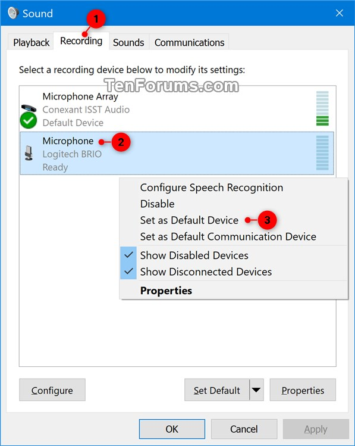

  

<h1 align="center">Voodoo — Magic mod for <i>A Township Tale</i></h3></h1>

  
  

---

# 🔮 What is Voodoo?

**Voodoo** is a community-made magic mod for [_A Township Tale_](https://townshiptale.com/), a VR MMORPG game.

**Voodoo** consists of a **Voodoo Client** application (the repository you're looking at right now), [**Voodoo Server**](https://github.com/mdingena/att-voodoo-server), and a hidden **Voodoo Spellbook**.

**Voodoo Client** is a speech recognition application for _A Township Tale_ that lets you invoke magic spells with your voice on game servers that support **Voodoo**.

[**Voodoo Server**](https://github.com/mdingena/att-voodoo-server) is our bot that listens to all the **Voodoo Clients** out there and sends console commands to the servers they are playing on.

**Voodoo Spellbook** is a hidden repository that **Voodoo Server** uses to compare a list of spells to what players are invoking. Because the **Spellbook** is hidden, players need to discover the right combination of incantations and material components for each spell on their own!

# ⚠️ Known issues

- Voodoo can say "Not near a Spellcrafting Conduit" even when you're standing next to a green crystal cluster. When this happens it means the ATT server's `select find <player>` command has broken and the server needs to be restarted. Alta is aware of this bug.
- Acid Bolt rarely connects with players or enemies. This doesn't appear to be a bug with Voodoo, as the mod doesn't change any wyrm spit properties.

# 🚀 Installation & usage

- [🕹️ Guide for players](./guides/PLAYERS.md)
- [🧰 Guide for server owners](./guides/SERVER-OWNERS.md)
- [✨ Casting spells](./guides/SPELLCASTING.md)
- [📖 Spellbook](./spellbook/README.md)
- [👩🏻‍🎓 Voodoo Vocabulary](./guides/VOCABULARY.md)
- [💬 Discord server](https://discord.gg/THy2AVBPHX)

# Frequently Asked Questions

Why is Voodoo not authenticating? It's stuck.

Make sure your system time is correct. Voodoo validates tokens retrieved from Alta and it compares the token's expiration date with your system time.

I can't awaken Voodoo. Why is it not picking up my voice?

Voodoo currently relies on Windows speech recognition which uses Windows language packs. Make sure you have **English (United States)** configured as one of your Windows languages. To configure your Windows languages:

1. Go to **Windows Settings**.
1. Click the **Time & Language** tile.
1. Click the **Language** tab.
1. In the **Preferred Languages** section, add **English (United States)**.
1. Restart Voodoo.

If Voodoo is still not picking up your voice, you must make sure that your Default Input Device is set to the microphone you're using _before_ you start Voodoo:

Why has Voodoo misheard what I said?

Speech recognition is tricky. Your accent might play a role as well (I'm not a native English speaker myself and it doesn't always correctly recognise what I said). The good news is, **Windows speech recognition can be trained**. Search online for ideas on how to train your speech recognition to more accurately understand the way **you** speak English.

# 🎩 Special thanks

## Poi

Poi's work unraveling the mysteries of _A Township Tale_'s save strings was instrumental in building Voodoo. Poi didn't directly work on Voodoo, but Voodoo would not exist without his help. Thank you for sharing your secrets!

## CJ (Siege)

CJ's mountain of experience with speech recognition helped shape the way you interact with Voodoo. His knowledge has informed the best way to deal with voice commands and how to handle or work around false positives.

# Maintainers

- [Marc Dingena](https://github.com/mdingena) (owner)

# Contributing

For bug fixes, documentation changes, and small features:

1. Fork this repository.
1. Create your feature branch (git checkout -b my-new-feature).
1. Commit your changes (git commit -am 'Add some feature').
1. Push to the branch (git push origin my-new-feature).
1. Create a new Pull Request.

**For larger new features**: Do everything as above, but first also make contact with the project maintainers to be sure your change fits with the project direction and you won't be wasting effort going in the wrong direction.
